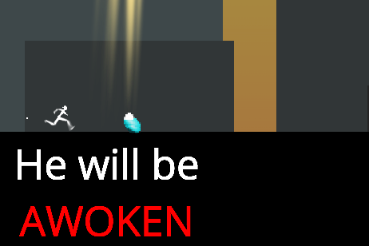
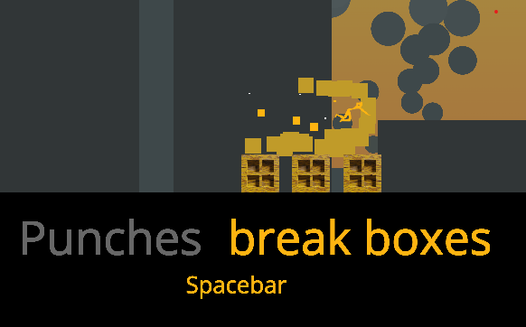
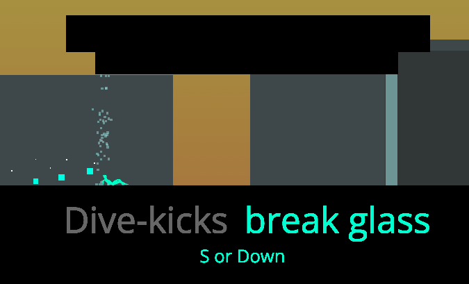
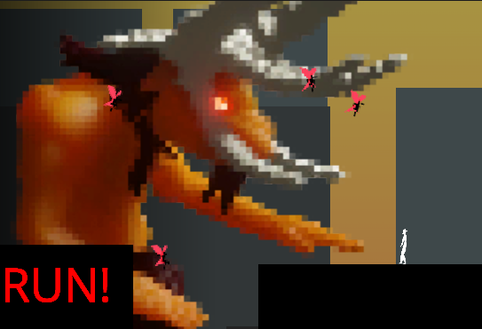

# deliver-them-from-sin
A unity game made in 48 hours for the 'Ludum Dare' Game Jam #53.

Play it over at:
https://ugly-robot.itch.io/deliver-them-from-sin
or
https://ldjam.com/events/ludum-dare/53/deliver-them-from-sin

With a demonic roar behind you, you leap through the window, clutching a swaddled infant. Somebody has to deliver these kids - and fast!  
A fast paced, physics-ish side-scrolling platformer where you will bash through crates, tumble out of windows, all with the great Taurus breathing down your neck.  
Can you dash over all the rooftops, and save those innocent souls?  

As always, the game is rushed and ugly - but I'm proud of what I learned, and how quickly I was able to get everything slapped together!  
  
Here are some tips! I don't think these are required to win, but it may help:
* When your character is in the air, they become gray, and can't again. However - notice when you break a box, you become white, and get your jump back!
* You can interrupt your slide or punch by jumping. With fast enough reflexes, you can even break through a window, and jump just as it shatteres!
* Normally, when punching/diving, you have to see it though. But! If you have your jump, you can interrupt it, then chain it into a dive!
* You take a while to get up to speed - unless you punch/dash to accelerate fast!

Thanks to:  
Unity  
Blender  
www.beepbox.co  
voicechanger.io  
mp3cut.net  
sfxr.me  
ldjam.com  
BEC & ESV  
  
All else solo (9p-12p fri, 6a-10p sat, 6a-2p sun)  
Thanks!  
